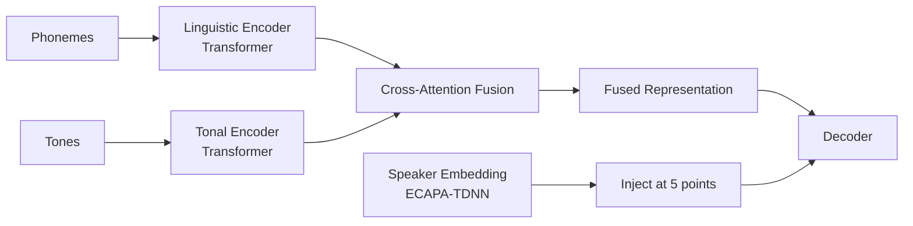

# System Architecture

## High-level Pipeline

```mermaid
graph TD
    A[Comic Pages (images/PDF)] --> B[CV Pipeline]
    B --> C[Text + Bubble BBox + Character IDs]
    C --> D[Speaker Attribution]
    D --> E[Text per Bubble + Character ID + Speaker Embedding]
    E --> F[TTS + Voice Cloning]
    F --> G[Audio Tracks per Page/Character]
    G --> H[Streaming Web Demo]
```

---

## TTS + Dual-Path Encoder Core



- **Linguistic Encoder** (Transformer x N layers): phoneme sequence → articulation, coarticulation
- **Tonal Encoder** (Transformer x M layers): tone sequence (0–6) → F0 contour shapes, tone transitions
- **Cross-Attention Fusion**: bidirectional (L→T + T→L) → fused representation cho posterior encoder, duration predictor, decoder

---

## Voice Cloning Integration

Reference Audio → ECAPA-TDNN → Speaker Emb [256] → g vector inject vào VITS2 (text encoder, posterior, flow, duration, decoder).

- Speaker encoder: ECAPA-TDNN (SpeechBrain pre-trained, fine-tuned trên VieNeu-TTS)
- Embedding: 192-d → project to 256 (gin_channels) → unsqueeze → g [B, 256, 1]
- 3-phase training: pre-train encoder → dual conditioning → zero-shot

---

## CV Pipeline Components

- **Detection**: YOLOv8 (bubble, character, panel)
- **OCR**: PaddleOCR detection + VietOCR recognition
- **Clustering**: ArcFace + DBSCAN/agglomerative
- **Attribution**: MLP/GNN hoặc rule-based fallback
- **Reading order**: LTR/RTL config + panel/bubble sort
- **Character DB**: lưu embedding face + speaker emb cho consistency

Xem chi tiết implementation trong .claude/rules/cv-pipeline.md và model-strategy.md.